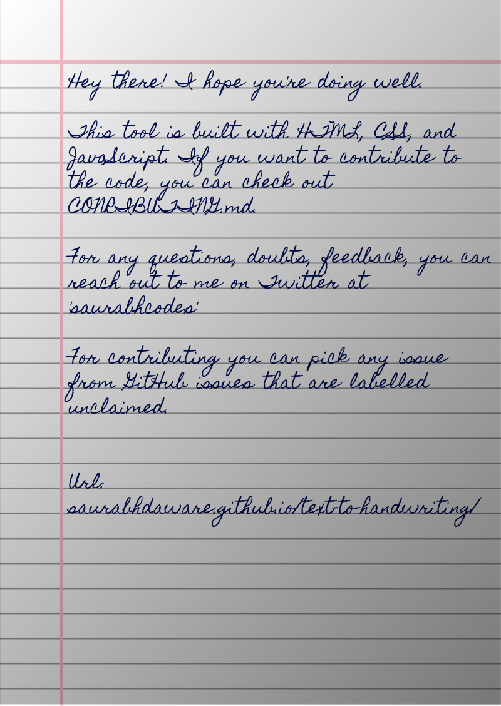

<a href="https://albinpraveen.github.io/TEXT-TO-HANDWRITING-BY-ALBY/">TEXT TO HANDWRITING (ALBY) </a>

   THIS PROJECT IS CLONED FROM saurabhdaware .THE REAL AUTHOR OF THIS PROJECT IS saurabhdaware
   I hate writing assignments so I made this tool that converts text to an image that looks like handwriting😛

## 🌠 Output

## 📚 Libraries used

- [html2canvas](https://github.com/niklasvh/html2canvas) - Turns DOM into Canvas.
- [jsPDF](https://github.com/MrRio/jsPDF) - To generate PDF from images.
- [cypress](https://github.com/cypress-io/cypress) - Testing Library
- [serve](https://github.com/zeit/serve) - Start local server

---

Bye!
Have fun 🦄
